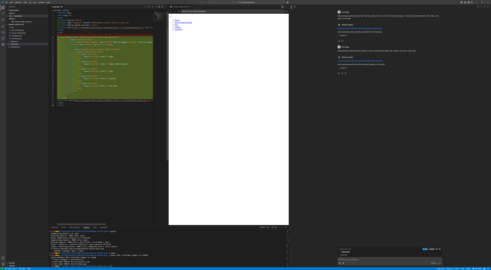
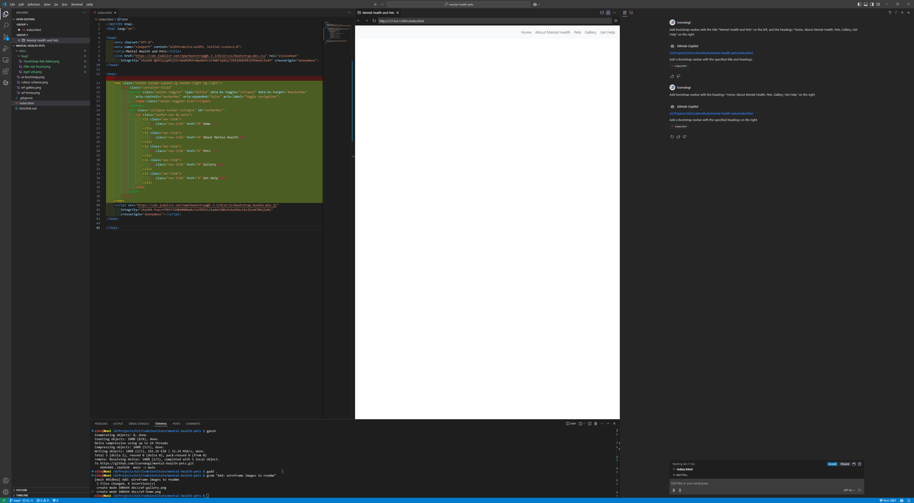

# Mental Health and Pets

## [Link to Live Site](https://lcorndogl.github.io/mental-health-pets/)

## Contents

- [Introduction](#introduction)
- [User Experience](#user-experience)
  - [Stories](#stories)
    - [External User Story](#external-user-story)
    - [Site Owner User Story](#site-owner-user-story)
  - [Strategy](#strategy)
  - [Scope](#scope)
  - [Wireframes](#wireframes)
    - [Homepage Wireframe](#homepage-wireframe)
    - [Gallery Wireframe](#gallery-wireframe)
    - [Mobile / Tablet / Desktop breakpoints](#mobile--tablet--desktop-breakpoints)
- [Design](#design)
  - [Colour Scheme](#colour-scheme)
  - [Imagery](#imagery)
  - [Typography](#typography)
- [Website Features](#website-features)
  - [Homepage](#homepage)
  - [About](#about)
  - [How pets can help](#how-pets-can-help)
  - [Gallery](#gallery)
  - [Get Help](#get-help)
- [Future Features](#future-features)
- [Technologies Used](#technologies-used)
  - [HTML Language](#html-language)
  - [CSS Styling](#css-styling)
  - [Git](#git)
  - [GitHub](#github)
  - [Visual Studio Code](#visual-studio-code)
  - [CoPilot](#copilot)
  - [bash terminal](#bash-terminal)
- [Deployment](#deployment)
- [Testing](#testing)
  - [Responsivity Images](#responsivity-images)
    - [Index](#index)
    - [Gallery](#gallery)
  - [Validation](#validation)
    - [HTML](#html)
    - [CSS](#css)
  - [Lighthouse Scores](#lighthouse-scores)
    - [Mobile](#mobile)
    - [Desktop](#desktop)
- [Bugs](#bugs)
    -[CoPilot Bootstrap Import Troubleshooting](#copilot-bootstrap-import-troubleshooting)
- [Credits](#credits)

## Introduction

###### [*Back to contents*](#contents)

Mental Health has become an issue that has some stigma attached to it, however with people now talking about it and the impacts that it can have on daily living, this project aims to highlight some of the things that pets can help with when dealing with mental health issues.

## User Experience

###### [*Back to contents*](#contents)

### Stories

###### [*Back to contents*](#contents)

#### External User Story

As a user, I want to be able to quickly find accessible, beginner-friendly information on mental health, including how to recognize common issues and manage stress, presented in a supportive and organised layout.

###### [*Back to contents*](#contents)

#### Site Owner User Story

I want to create a welcoming webpage that provides basic mental health information using a clean and supportive design. The focus is on using HTML and CSS with Bootstrap to create a calming and well-organised user experience.

###### [*Back to contents*](#contents)

### Strategy

To achieve the stories set out by both the external user and as the site owner, I decided that a primarily single page website would be utilised, this allows for all of the relevant information to be accessible without having to search through the different pages to find it.

To help achieve this I utilised the use of in page links, linking to the various heading that are within the index page.

As an extra addendum, I added a gallery page, with it's sole purpose to hold images and keep the index page free from clutter, which may take attention away from the key information which may be able to save a life!

I included a get help button both in the nav bar and below the content on all pages, which when clicked opens a modal with information on services which may be able to offer help to people who need it.

All of the information on the site has been taken from org.uk websites, so as to provide as accurate information as possible, so as to not mislead anyonw who is visiting the site and avoid causing harm to any individual or group.

###### [*Back to contents*](#contents)

### Scope

The scope of this project aims to get important information available to people who may need it, presented in a consistent and responsive manner regardless of which device is used.

This is achieved with a combination of HTML, CSS, Bootstrap and CoPilot AI.

###### [*Back to contents*](#contents)

### Wireframes

###### [*Back to contents*](#contents)

#### Homepage Wireframe


###### [*Back to contents*](#contents)

#### Gallery Wireframe


###### [*Back to contents*](#contents)

#### Mobile / Tablet / Desktop breakpoints

I have utilised the same breakpoints that are used in developer features, these are sometimes out slightly vs what you would see in the bootstrap features, but using these in conjunction has had no negative impact on how the site renders across various devices, as the main issue would have been the navbar and this expanding ~30px earlier does not cause any text overlaps.

For avoidance of doubt - the breakpoints I used are 768px, 1024px & 1440px.

###### [*Back to contents*](#contents)

## Design

###### [*Back to contents*](#contents)

### Colour Scheme

The colour scheme has been chosen with the familiar colours of the NHS in the UK in mind, this is instill a consistency with the user expectations of other health services

[Coolors for the colour scheme](https://coolors.co/ebebeb-c2b8b2-197bbd-090c9b-2a2b2a)


###### [*Back to contents*](#contents)

### Imagery

The imagery used in this project has been taken by myself and my experiences owning my own pet.

###### [*Back to contents*](#contents)

### Typography

The typography used has been selected from Google Fonts, searching using the 'calm' filter, as a little addage to people who may be suffering with mental health and looking for information, as to not be an agressive font which could cause further issues in extreme cases. From this filter I have settled on the "Quicksand" and "Sour Gummy" fonts.

###### [*Back to contents*](#contents)

## Website Features

###### [*Back to contents*](#contents)

### Homepage

A homepage which is loaded when a user enters the site. It provides information in an easily accessible format. It also contains all the subheadings for the rest of the page as well as a modal with information where users can get help that is always available.

###### [*Back to contents*](#contents)

### About

This section provides a brief overview of what mental health is and important aspects to be achieved to help with having good mental health, as well as the effects that it can have on different people.

###### [*Back to contents*](#contents)

### How pets can help

This section consists of 6 cards that include the possible benefits a pet can have on mental health.

###### [*Back to contents*](#contents)

### Gallery

This section houses various images of my pet - Marley, showing the joy that a pet can bring by just being caring, unjudgemental and enjoying life as it happens, as well as providing regular routine and exercise.

###### [*Back to contents*](#contents)

### Get Help

This section is a modal that is on every page - accessed by either clicking the get help button in the nav bar, or the one located at the bottom of each page - both open up the same modal menu, making it easy for the user to get information to the services needed to get any help that they may need.

###### [*Back to contents*](#contents)

## Future Features

- Add custom domain to project to make it available at "<https://mhp.michaelcornall.co.uk>" with an SSL certificate.
- Add more responsiveness queries to limit image sizes on smaller displays
- Add in smaller hero images to overwrite the background: url("") in the responsiveness section of the CSS to assist with load times on smaller devices

###### [*Back to contents*](#contents)

## Technologies Used

###### [*Back to contents*](#contents)

### HTML Language

Basic HTML is used to create the information to be displayed in the pages, links and other general website functions

###### [*Back to contents*](#contents)

### CSS Styling

CSS is used to allow the formatting of the website, making it responsive and intuitive for the user to use

###### [*Back to contents*](#contents)

### Git

Git has been used to create versioning for the site as it is developed.

###### [*Back to contents*](#contents)

### GitHub

GitHub has been used as the central respository where the code will be accessible online. It has also been used to deploy the website to allow for testing throughout the development process as well as a location for the project to be visible to all

###### [*Back to contents*](#contents)

### Visual Studio Code

Visual Studio Code has been used to create the project as a pseudo-IDE, allowing for the use of emmet commands to help create the code in an efficient manner, as well as CoPilot integration

###### [*Back to contents*](#contents)

### CoPilot

CoPilot has been used as the AI tool in this project, utilising it for both helping with code creation such as pulling bootstrap templates into the code rather than using a search engine and the documentation where possible. It has also been used to help troubleshoot any errors within the code, and helping with getting the layout of the project correct in places where I may have struggled without it.

I used copilot at various points to help create code for the project - primarly to import bootstrap styles, saving the need to go and search for these myself. I also used AI for various alignments of text throughout the document, as an example in the footer to have 3 separate footer sections across the page.

###### [*Back to contents*](#contents)

#### AI Bootstrap


###### [*Back to contents*](#contents)

#### AI Navbar


###### [*Back to contents*](#contents)

#### AI Main Skeleton


###### [*Back to contents*](#contents)

### bash terminal

Bash Terminal used for adding and commiting files to the git repository, providing versioning as well as pushing these files to GitHub as a centralised location and deployment

###### [*Back to contents*](#contents)

## Deployment

1) Add the required files to the git repository with the command `git add .`
2) Commit the changes to the repository with the command commit command `git commit -m "Final project commit"`
3) Open up the repository and go to the settings > pages menu ([Mental Health Pets GitHub pages link](https://github.com/lcorndogl/mental-health-pets/settings/pages))
4) Select the root directory and main branch to deploy the project 
5) Verify that the project has been deployed by going to the main repository page (Code) and checking the deployment status on the right hand side
[Link to Deployed Site](https://github.com/lcorndogl/mental-health-pets/settings/pages)


###### [*Back to contents*](#contents)

## Testing

###### [*Back to contents*](#contents)

### Responsivity Images

###### [*Back to contents*](#contents)

#### [Index](https://ui.dev/amiresponsive?url=https://lcorndogl.github.io/mental-health-pets)


###### [*Back to contents*](#contents)

#### [Gallery](https://ui.dev/amiresponsive?url=https://lcorndogl.github.io/mental-health-pets/gallery.html)

###### [*Back to contents*](#contents)

##### On Load


###### [*Back to contents*](#contents)

##### On Scroll


###### [*Back to contents*](#contents)

### Validation

###### [*Back to contents*](#contents)

#### HTML

###### [*Back to contents*](#contents)

##### [Index HTML Validation](https://validator.w3.org/nu/?doc=https%3A%2F%2Flcorndogl.github.io%2Fmental-health-pets%2F)


###### [*Back to contents*](#contents)

##### [Gallery HTML Validation](https://validator.w3.org/nu/?doc=https%3A%2F%2Flcorndogl.github.io%2Fmental-health-pets%2Fgallery.html)


###### [*Back to contents*](#contents)

#### CSS

##### [Index CSS Validation](https://jigsaw.w3.org/css-validator/validator?uri=https%3A%2F%2Flcorndogl.github.io%2Fmental-health-pets%2F&profile=css3svg&usermedium=all&warning=1&vextwarning=&lang=en)

###### [*Back to contents*](#contents)


###### [*Back to contents*](#contents)

##### [Gallery CSS Validation](https://jigsaw.w3.org/css-validator/validator?uri=https%3A%2F%2Flcorndogl.github.io%2Fmental-health-pets%2Fgallery.html&profile=css3svg&usermedium=all&warning=1&vextwarning=&lang=en)


###### [*Back to contents*](#contents)

### Lighthouse Scores

###### [*Back to contents*](#contents)

#### Mobile

###### [*Back to contents*](#contents)

##### Index Mobile


###### [*Back to contents*](#contents)

##### Gallery Mobile


###### [*Back to contents*](#contents)

#### Desktop

###### [*Back to contents*](#contents)

##### Index Desktop


###### [*Back to contents*](#contents)

##### Gallery Desktop


###### [*Back to contents*](#contents)

## Bugs

###### [*Back to contents*](#contents)

### CoPilot Bootstrap Import Troubleshooting

At the beginning of the project I used AI to import the bootstrap library - originally importing 5.1.3, after it did this I asked it to import 5.3.3 and it changed the URL where the version number is denoted to 5.3.3. This however caused the issue of the CDN being different for 5.3.3 so it was linking to a CSS file that didn't actually exist, which I didn't find out until I tried to add a navbar which made use of the bootstrap classes as I inserted the bootstrap CSS link first.

1. Seeing the navbar is all messed up initially when trying to insert it into the code



2. Going to the specified CSS file location in the code and realising that the URL is incorrect


3. Manually getting the bootstrap URLs and replacing the broken links with these


4. Accepting navbar code after bootstrap link is resolved



###### [*Back to contents*](#contents)

## Credits

###### [*Back to contents*](#contents)

### [Bootstrap](https://www.getbootstrap.com) - [Version 5.3.3](https://getbootstrap.com/docs/5.3/getting-started/introduction/)

###### [*Back to contents*](#contents)

### CodeInstitute

###### [*Back to contents*](#contents)

#### Javascript code used to collapse navbar when a link is clicked

```javascript
<script>
    document
        .querySelectorAll(".navbar-collapse .nav-link")
        .forEach((link) => {
            link.addEventListener("click", function (e) {
                let section = document.querySelector(e.target.getAttribute("href"));
                if (section) {
                    e.preventDefault(); // Prevent default anchor click behavior
                    let navbarHeight = document.querySelector(".navbar-toggler").offsetHeight;
                    window.scroll({
                        top: section.offsetTop - navbarHeight, // Adjust for navbar height
                        behavior: "smooth",
                    });
                    document
                        .querySelector(".navbar-collapse")
                        .classList.remove("show"); // Collapse navbar
                }
            });
        });
</script>
```

###### [*Back to contents*](#contents)

### [Coolors for the colour scheme](https://coolors.co/ebebeb-c2b8b2-197bbd-090c9b-2a2b2a)

###### [*Back to contents*](#contents)

### [Mental Health Foundation (Various information on pets)](https://www.mentalhealth.org.uk/explore-mental-health/a-z-topics/pets-and-mental-health#:~:text=The%20companionship%20of%20a%20pet,you%20feel%20isolated%20or%20misunderstood)

###### [*Back to contents*](#contents)

### [Mind.org.uk - Support line help](https://www.mind.org.uk/information-support/guides-to-support-and-services/seeking-help-for-a-mental-health-problem/mental-health-helplines/)

###### [*Back to contents*](#contents)

### [NHS urgent help for mental health](https://www.nhs.uk/nhs-services/mental-health-services/where-to-get-urgent-help-for-mental-health/)

###### [*Back to contents*](#contents)

### [NHS - Information on some mental health problems](https://www.nhs.uk/nhs-services/mental-health-services/)

###### [*Back to contents*](#contents)

### [Stack Overflow - Undo Git Commit](https://stackoverflow.com/questions/927358/how-do-i-undo-the-most-recent-local-commits-in-git)

###### [*Back to contents*](#contents)

### Image Conversion

###### [*Back to contents*](#contents)

#### [Picflow - Image conversion to webp](https://picflow.com/convert/jpg-to-webp)

###### [*Back to contents*](#contents)

#### [Image Resizer to resize images](https://imageresizer.com/bulk-resize)

###### [*Back to contents*](#contents)

#### [CloudConvert - Convert images to webp format](https://cloudconvert.com/jpg-to-webp)

###### [*Back to contents*](#contents)

### Fonts

###### [*Back to contents*](#contents)

#### [Quicksand](https://fonts.google.com/specimen/Quicksand?categoryFilters=Feeling:%2FExpressive%2FCalm)

###### [*Back to contents*](#contents)

#### [Sour Gummy](https://fonts.google.com/specimen/Sour+Gummy)

###### [*Back to contents*](#contents)
